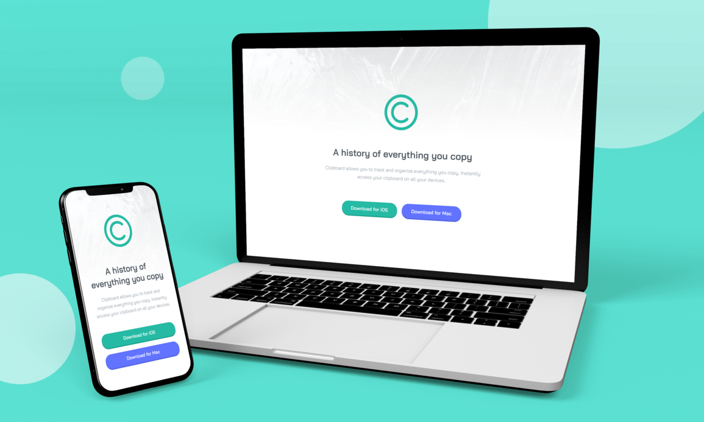

# Clipboard landing page

This is a solution to the [Clipboard landing page challenge on Frontend Mentor](https://www.frontendmentor.io/challenges/clipboard-landing-page-5cc9bccd6c4c91111378ecb9). Frontend Mentor challenges help you improve your coding skills by building realistic projects. 

## The challenge

Users should be able to:

- View the optimal layout for the site depending on their device's screen size
- See hover states for all interactive elements on the page

## Links

- Solution URL: [https://www.frontendmentor.io/solutions/responsive-landing-page-using-html-and-css-AE1-pI5eI](https://www.frontendmentor.io/solutions/responsive-landing-page-using-html-and-css-AE1-pI5eI)
- Live Site URL: [https://clipboard-landing-page-asmaamk.vercel.app/](https://clipboard-landing-page-asmaamk.vercel.app/)

## Built with

- Semantic HTML5 markup
- CSS custom properties
- Flexbox
- CSS Grid
- Mobile-first workflow

## Author

- Website - [Asmaa Mahmoud](https://asmaa-mahmoud.vercel.app/)
- Frontend Mentor - [@AsmaaMK](https://www.frontendmentor.io/profile/AsmaaMK)
- Linkedin - [@asmaa-m-khalaf-04688a18b](https://www.linkedin.com/in/asmaa-m-khalaf-04688a18b/)